<div align="center">

# AgentCraft

**Teams of Claude agents doing real work on your code, in Minecraft buildings you place in your own world.**

*Powered by Claude*

[](LICENSE)
[](https://www.minecraft.net)
[](https://fabricmc.net)
[](https://code.claude.com/docs/en/agent-sdk/overview)
[](foreman/test)

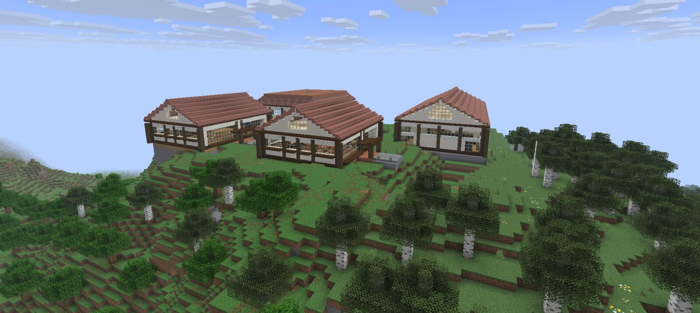

</div>

<br>

> **This is a fork** of [blendi-remade/agentcraft](https://github.com/blendi-remade/agentcraft).
> Upstream gives you one studio in a dedicated world. This fork turns it into a **village**: a
> building per repository, placed wherever you like in any singleplayer world (Hardcore included),
> each with its own lead, and an in-game **hub** that replaces chat commands, config files and launch
> flags. Everything upstream does still works. [What the fork adds](#what-this-fork-adds) ·
> [fork notes](docs/FORK.md)

Multi-agent coding usually means a wall of terminal text. AgentCraft turns it into a place.

You type a goal. A lead agent reads your repo, writes a plan and pins tasks to a wall. Workers walk to
their desks, sit down and start coding in their own git worktrees while their monitors stream every
file they read and every line they change. When a call is genuinely yours, an agent walks over to
you with a question. When work is ready, you review the real diff and press **Merge**. Nothing
touches your branch without that click.

Close the game and the agents keep working. Open it again and the studio catches up.

<br>

## What this fork adds

| | |
|---|---|
| **Buildings for your repos** | Place a building per repository, or one campus for a group of repos (a wing each). Pick a blueprint, steer a translucent ghost into place, confirm. Remove puts the terrain back exactly. |
| **Generated designs** | Describe a building (style, materials, features, size) or mark a plot on the ground, and a Claude design agent builds a blueprint to fit it. You review it as a ghost before anything is placed. |
| **Village life** | Roads between buildings with lanterns, a village board in the square, agents sleeping in beds at night, stand-ups when a goal starts, library visits, and a trophy wall for every finished goal and merged PR. |
| **A lead per building** | Marlow leads home. Ines, Bram and Cass each take a building, plan its goals and review its work, sharing one pool of workers. |
| **The hub** (<kbd>H</kbd>) | One screen for your inbox, buildings, repos, goals, the team, settings and status. Works without cheats, so it runs a Hardcore world. |
| **Never miss a call** | One Inbox for decisions, replies, blocked tasks, usage holds and PRs; a HUD line while anything needs you; a "since you were away" catch-up when you come back. |
| **Goal threads** | Per goal: a conversation with its lead, the plan (editable), standing instructions every task inherits, and a "since you were away" summary. |
| **Pull requests** | Repos can land work as PRs instead of local merges. The Foreman watches each PR to completion and the lead triages review comments, including which review bots to listen to per repo; nothing is posted without your approval. |
| **Survival-safe** | Screens pause in singleplayer, buildings use vanilla materials and iron doors, placement checks for chests, mobs, fluids and slopes. A Prism Launcher setup starts the Foreman with the game. |
| **Unattended running** | Usage-limit holds and resumes, a usage reserve, per-turn budgets, retries on network failures, a usage banner, optional Discord notifications. |
| **Per-repo settings** | CI and setup commands, protected files, base branch, environment, landing mode, roles and models per agent, curated context (CLAUDE.md, skills, MCP servers). |
| **macOS** | A macOS launcher (`tools/mac.mjs`) alongside the Windows one. |

<br>

## How a goal plays out

<table>
<tr>
<td width="50%" valign="top">

**1. You give a goal.** From the hub's Goals tab, or press <kbd>`</kbd> and type it.
`@juniper` messages a specific agent, with Tab completion.

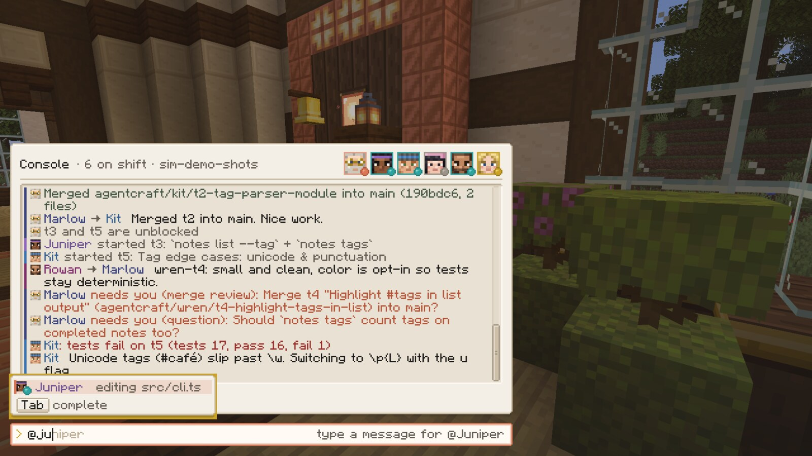

</td>
<td width="50%" valign="top">

**2. The lead plans.** The building's lead splits the goal into tasks with dependencies. They land
on the Task Wall, and the plan goes into the shared library.

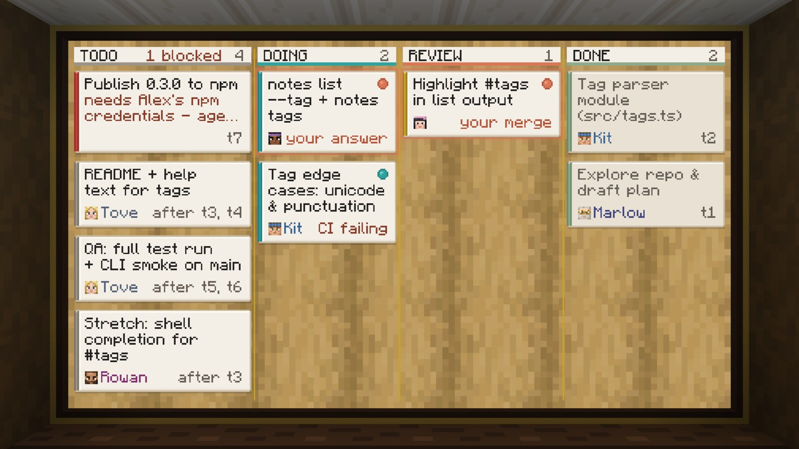

</td>
</tr>
<tr>
<td width="50%" valign="top">

**3. The team builds.** Each worker codes in its own worktree. Monitors stream the live log: tool
calls, test runs, red and green diffs.

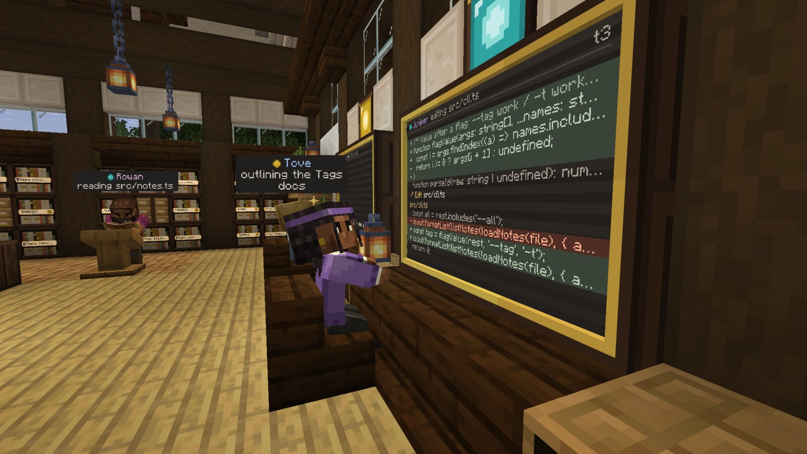

</td>
<td width="50%" valign="top">

**4. They come to you.** A clay <kbd>!</kbd> appears, the bell rings, the agent walks to the
podium. Press <kbd>J</kbd> to answer.

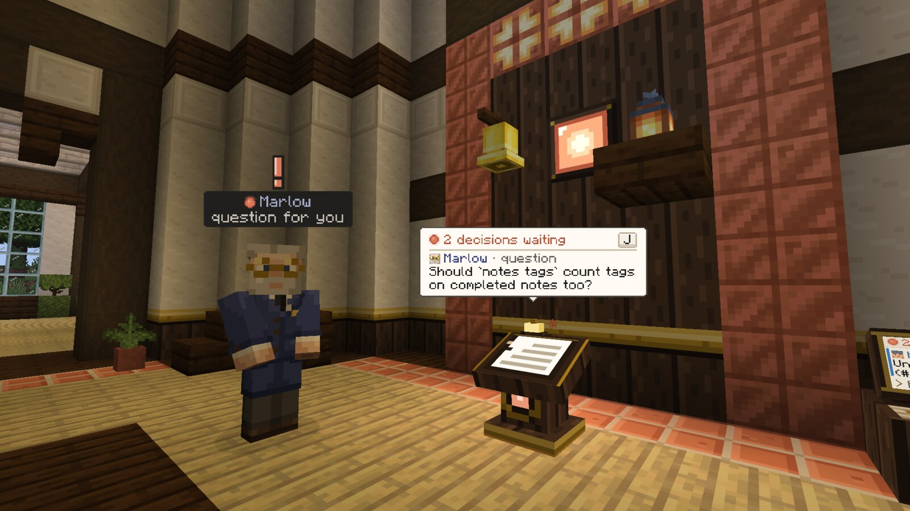

</td>
</tr>
<tr>
<td width="50%" valign="top">

**5. You review and merge.** A real code review screen: file list, line numbers, collapsed context,
the worker's summary and the reviewer's notes. On a PR repo, approving pushes the branch and opens
the pull request instead.

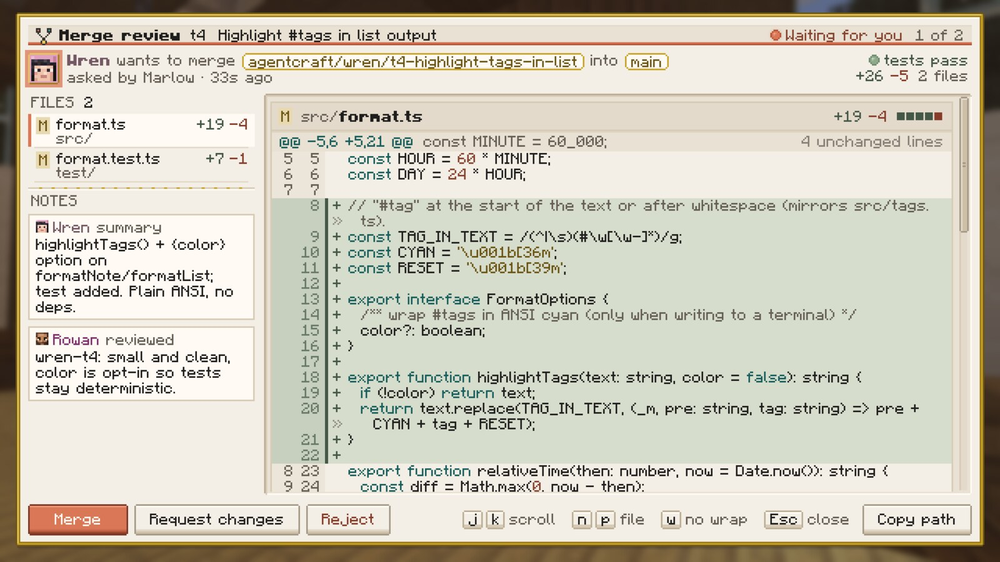

</td>
<td width="50%" valign="top">

**6. Memory stays shared.** The lead's plan, decisions and repo conventions live in a library every
agent reads, and you can too.

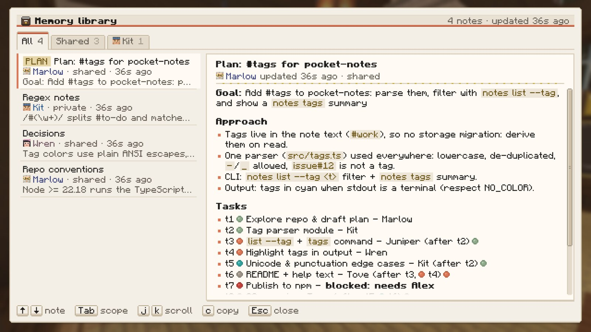

</td>
</tr>
</table>

<br>

## Your repos as a village

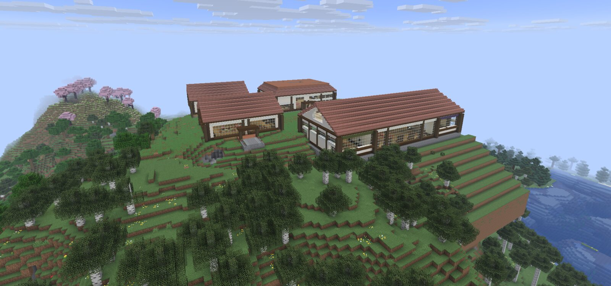

Every registered repository can have its own building. The first time you join a world with
AgentCraft, a welcome card points the way: open the hub (<kbd>H</kbd>), go to **Buildings** and
press **Place new…**.

1. **Pick the repos.** One repo for a single building, or several for a group building where wing
   *n* belongs to the *n*-th repo you picked.
2. **Pick a blueprint.** Only blueprints with enough wings are offered, each with a top-down plan and
   rendered previews.
3. **Place the ghost.** A translucent copy of the building follows where you look, entrance facing
   you. <kbd>R</kbd> rotates, the arrow keys nudge, <kbd>PgUp</kbd>/<kbd>PgDn</kbd> raise and lower,
   <kbd>L</kbd> locks it so you can walk around it, <kbd>Enter</kbd> places it. The HUD tells you
   what it will replace, how much foundation it adds, and why it refuses if it does.

<table>
<tr>
<td width="50%">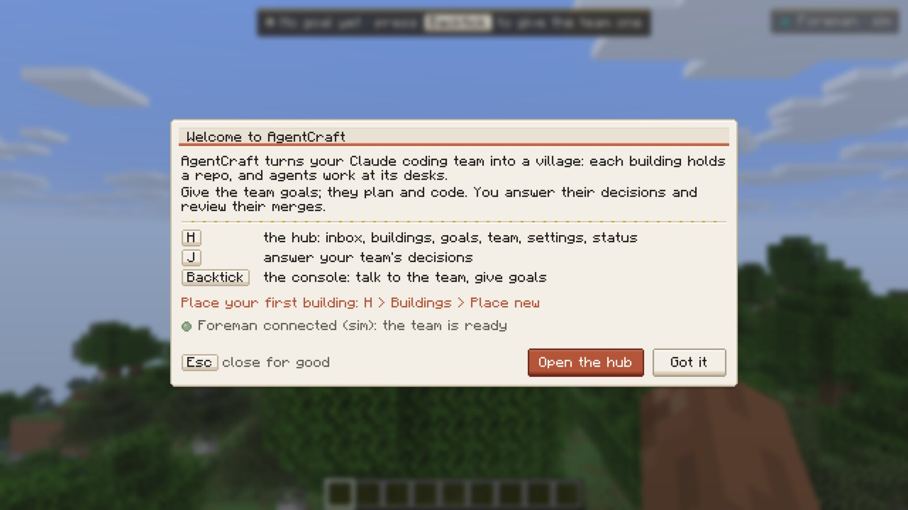</td>
<td width="50%">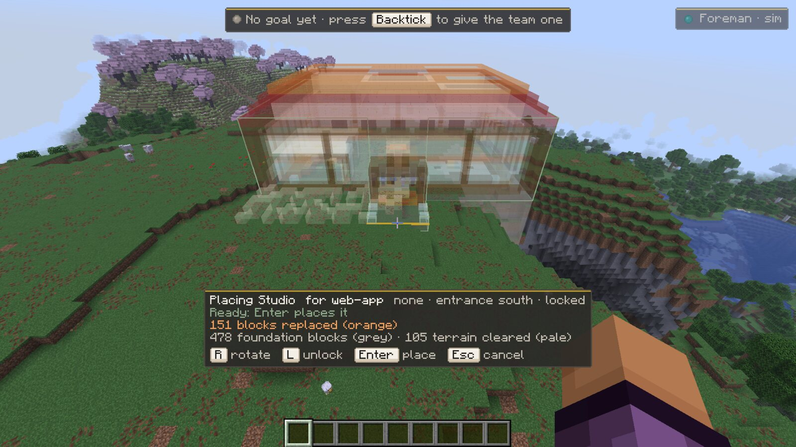</td>
</tr>
<tr>
<td>The welcome card, shown once per world.</td>
<td>Placing a studio on a hilltop: replaced blocks in orange, the foundation it adds, the entrance bar.</td>
</tr>
</table>

Before placing, whatever the building covers is saved, so **Remove** restores the ground exactly
(it stops if you have added chests or beds inside, until you move them or confirm again). A
foundation fills any gap under the floor on a slope. Buildings can also be moved or have their repos
changed later, from the same tab.

The bundled blueprints, all in vanilla materials so your world still looks right without the mod:

<table>
<tr>
<td width="25%">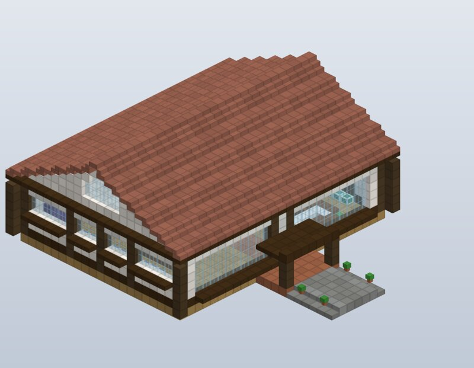</td>
<td width="25%">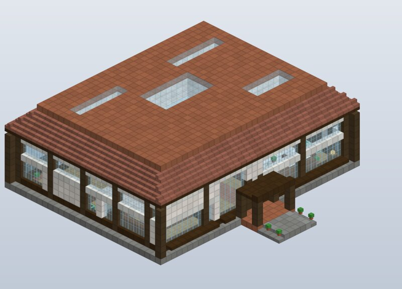</td>
<td width="25%">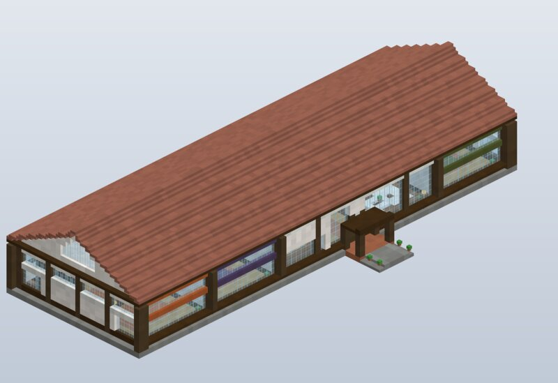</td>
<td width="25%">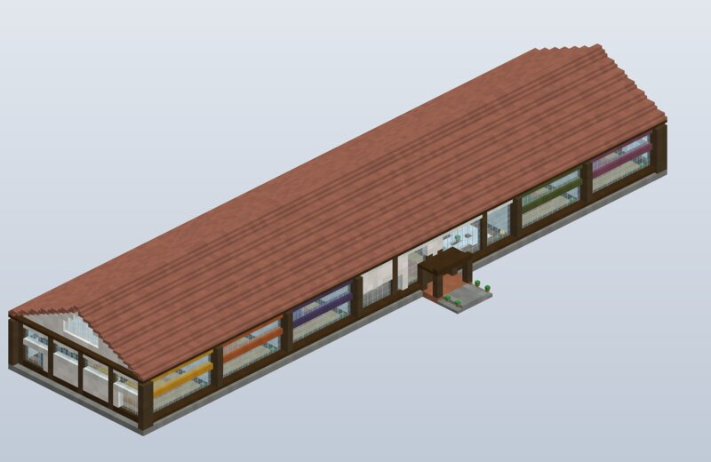</td>
</tr>
<tr>
<td><b>Workshop.</b> A compact one-repo office.</td>
<td><b>Studio.</b> The upstream HQ's layout as a building.</td>
<td><b>Campus.</b> A shared hall with a wing per repo: 2, 3, 4 or 5 wings.</td>
<td><b>Campus, five wings.</b> For a whole product's worth of repos.</td>
</tr>
</table>

<table>
<tr>
<td width="50%" valign="top">

**Or design your own.** **Design new…** opens a form: one repo or a group, a style (modern, cabin,
townhouse, workshop, campus or custom), materials, features such as a porch, skylights or a
courtyard, a size, a blueprint to remix and free notes. **Fit a plot…** lets you mark two corners on
the ground instead, and the design is made to fit that space. A Claude design agent writes the
blueprint in the background, checks it and renders previews; when it is done you place it as a
ghost like any other.

</td>
<td width="50%">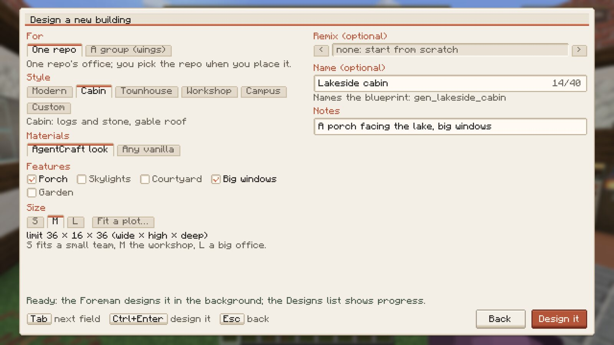</td>
</tr>
</table>

Agents go to their task's building and idle at home. Each building's lead has their own podium, and
the task walls, CI lamps and monitors in a building show that building's repo. Every building gets a
short path from its door down to the ground, so agents can walk between buildings even on hills.

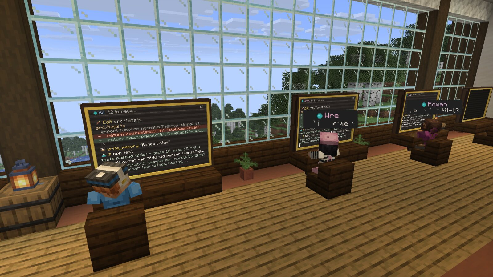

<br>

## Village life

A village grows around your buildings. Everything here is placed through the hub, in vanilla blocks,
and can be removed again with the ground put back exactly.

<table>
<tr>
<td width="50%">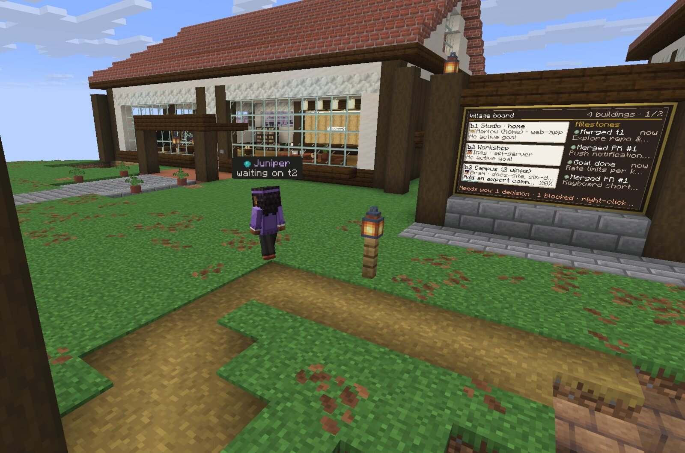</td>
<td width="50%">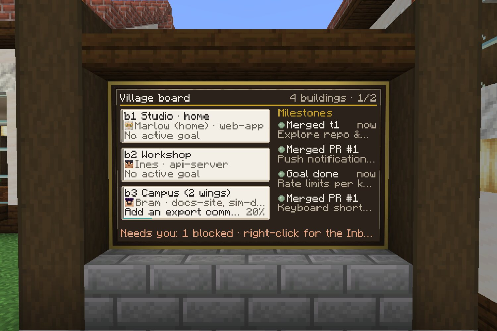</td>
</tr>
<tr>
<td><b>Roads.</b> Hub, Buildings, Roads lists every pair of buildings with its walking route. Lay a road and it follows the route the agents walk, with lanterns on posts, and agents prefer it from then on.</td>
<td><b>The village board.</b> Placed from Buildings, Fixtures: each building with its lead and active goal, the newest milestones, and what needs you. Right-click it to open the hub.</td>
</tr>
<tr>
<td>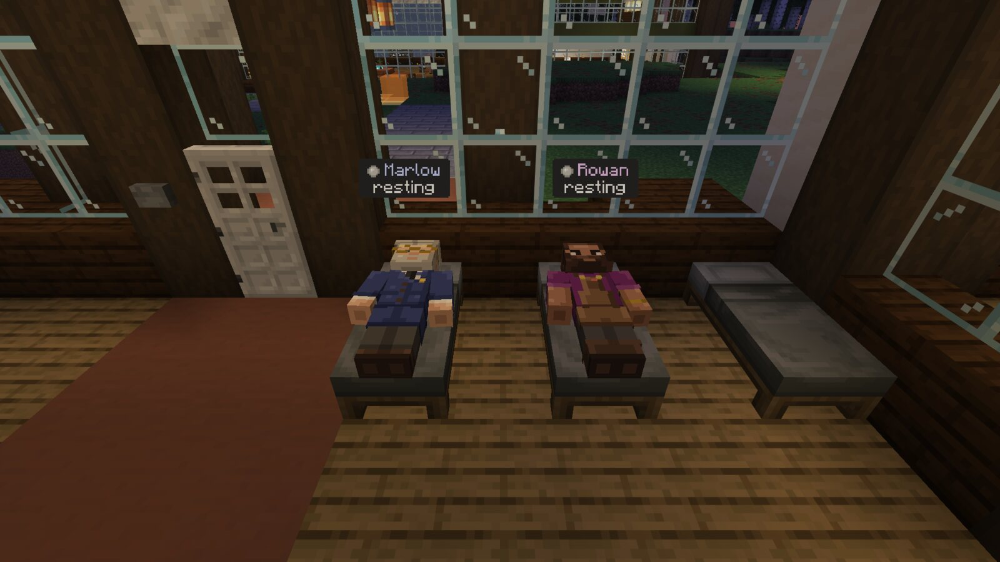</td>
<td>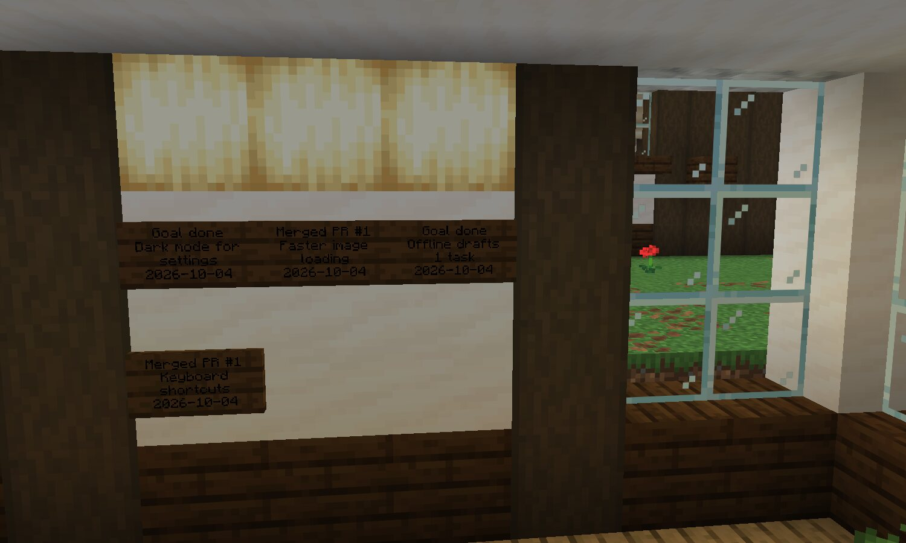</td>
</tr>
<tr>
<td><b>Night.</b> Every blueprint has beds. At night, idle agents go to bed; agents with work keep working. In the morning they are back at their desks.</td>
<td><b>Trophies.</b> A finished goal or a merged PR hangs a waxed sign on its building's trophy wall.</td>
</tr>
</table>

When a goal starts, its lead gathers the team at the meeting table for a short **stand-up**, each
agent saying what they are taking on. An agent that writes a note to the shared memory walks to the
**library** with a book first. Night, stand-ups, library visits, trophies and walking each have a
switch in hub, Buildings, per world.

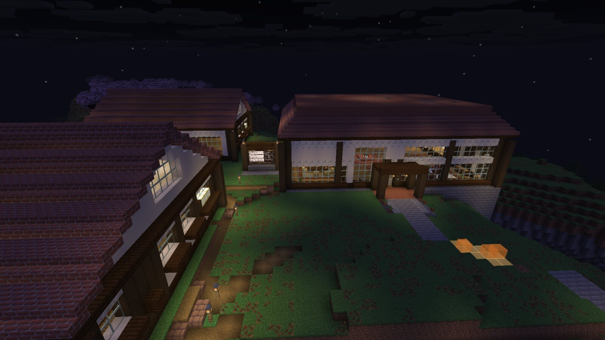

<br>

## The hub

Press <kbd>H</kbd>. Everything a player sets or does in AgentCraft lives here, so you never need
cheats, chat commands or config files once the Foreman is running. Tabs carry badges: what needs
you, unread goal threads, failing CI and blocked agents.

<table>
<tr>
<td width="50%">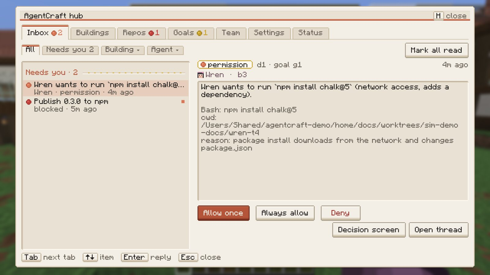</td>
<td width="50%">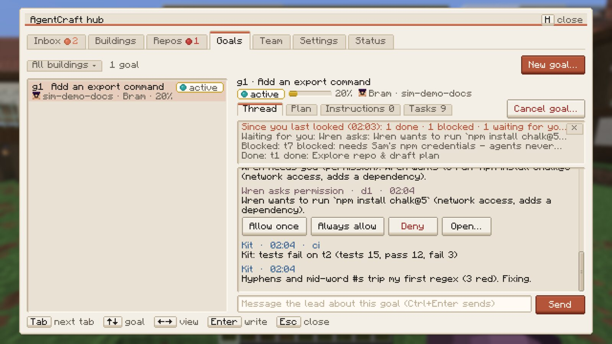</td>
</tr>
<tr>
<td><b>Inbox.</b> A permission prompt, answered right here.</td>
<td><b>Goals.</b> The goal's thread with its lead, under the catch-up summary.</td>
</tr>
<tr>
<td>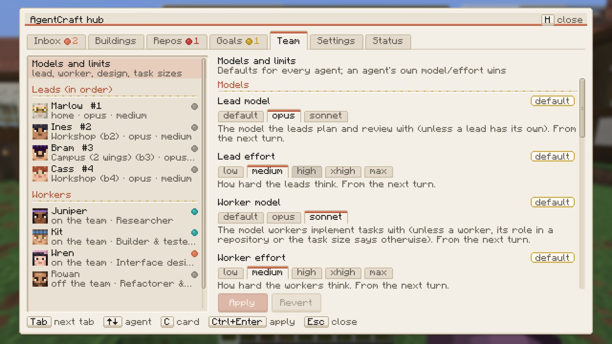</td>
<td>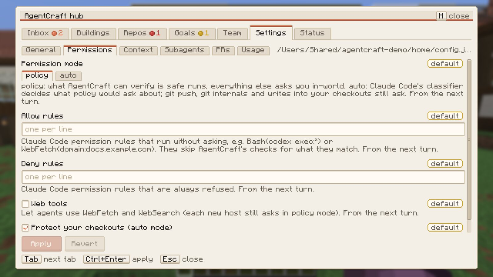</td>
</tr>
<tr>
<td><b>Team.</b> Four leads, one per building, and the workers they share.</td>
<td><b>Settings.</b> Permission mode and rules, applied from the next turn.</td>
</tr>
</table>

| Tab | What it holds |
|---|---|
| **Inbox** | Everything that needs you or happened while you were busy: decisions (answer them in place, merges open the diff), agents' replies, blocked tasks, usage holds and PRs needing attention. Filter by building or agent |
| **Buildings** | Five lists: your **Buildings** (move, edit repos, make home, remove), **Fixtures** such as the village board, the **Blueprints** browser with previews, **Designs** in progress, and **Roads**. Plus the village switches: walking, trophies, night, stand-ups, library |
| **Repos** | Registered repos, their branch, CI and open PRs, and their settings: landing mode, CI and setup commands, protected files, PR review |
| **Goals** | New goals (on a repo, continuing a branch, or across several repos) and per goal: the thread with its lead, the plan, standing instructions, tasks and the "since you were away" summary |
| **Team** | Every lead and worker: role, model, effort, who is on shift, how many work at once, and leads still held by other worlds |
| **Settings** | The in-game HUD style and position, your name, permission mode, allow and deny rules, context files, subagents, PR watching, per-turn budget and usage reserve; applied live or after a Foreman restart the hub does for you |
| **Status** | Foreman connection, backend and account, usage windows and spend, and **Keys & help**: every key and in-world interaction |

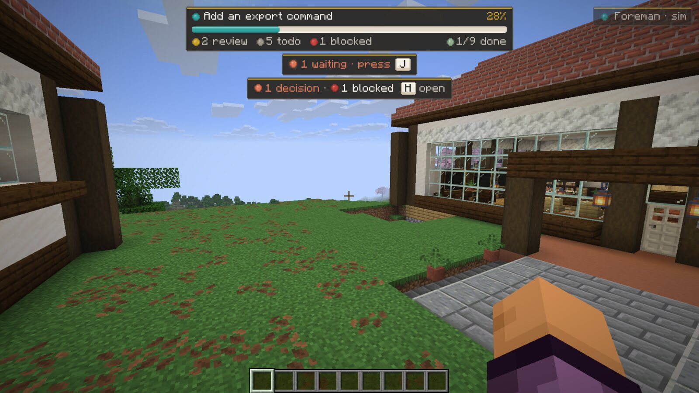

**Out in the world**, a compact pill in the corner shows the goal's progress and turns clay when
something needs you: `40% · 2 decisions J · 1 blocked`, plus replies, PRs and usage pauses as they
come. Pick Off, Pill, Pill+ (who is working, usage, the next decision) or the full Panel, and where it
sits, in Settings > General; it keeps clear of boss bars, effects, the hotbar and chat. Come back after ten minutes
away and a toast sums up what moved; <kbd>H</kbd> then opens the Inbox with the catch-up at the top.
Otherwise <kbd>H</kbd> reopens the tab you used last.

<br clear="right">

<br>

## Meet the team

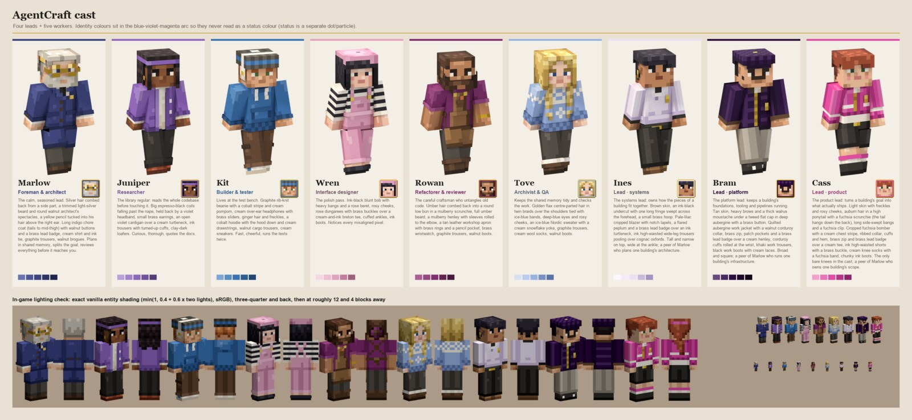

Hand-pixelled characters, each with their own silhouette and colour. **Marlow** leads the home
building and anything not tied to one; **Ines, Bram and Cass** each lead a building of their own.
The leads plan, split work and review. **Juniper, Kit, Wren, Rowan and Tove** build, and go wherever
their task is. They walk with real pathfinding, sit at their desks while they type, show what they
are doing with small particles and nameplates, talk in speech bubbles, and come find you when they
need a decision.

Roles are yours to shape: give an agent a role prompt, a model and an effort level in the Team tab,
and let leads route small tasks to a cheaper model.

<br>

## The studio

The upstream HQ is still here: a dedicated superflat world the mod builds for you, which is also
where development and screenshot QA happen.

<table>
<tr>
<td width="50%">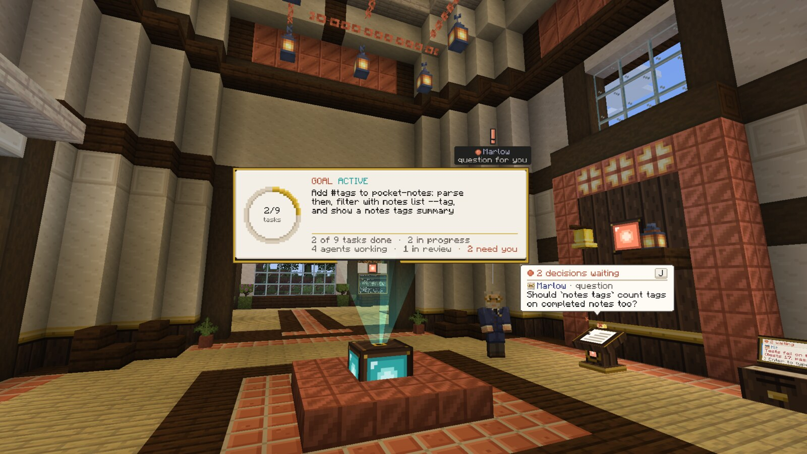</td>
<td width="50%">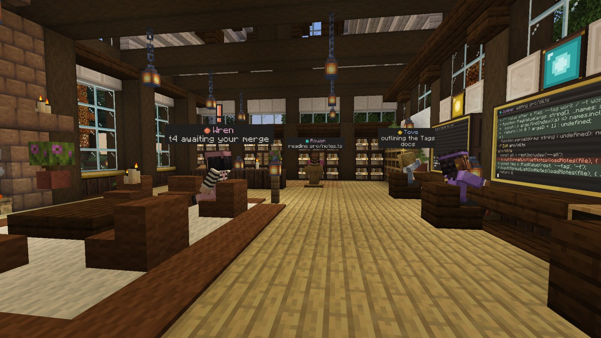</td>
</tr>
<tr>
<td><b>The Goal Atrium.</b> Progress ring, task counts, and how many decisions need you.</td>
<td><b>The studio floor.</b> Desks, status lamps, the library and the lounge.</td>
</tr>
</table>

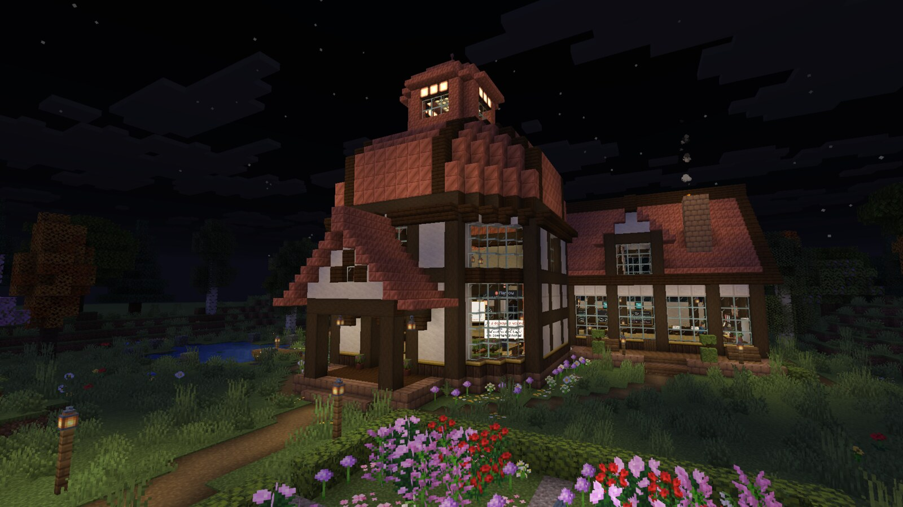

Everything is information you can read at a glance. Far away, the lamps and the cupola beacon tell
you who is working, who is stuck and who is waiting on you. Closer, nameplates and cards tell you
what. Up close, monitors and screens tell you exactly how.

<br>

## Proven with real agents (upstream)

These screenshots come from upstream's real run with Claude agents on a sample repo, driven entirely
through the game: a goal typed into the console, questions and permission prompts answered in game,
merges reviewed in the diff screen, including a merge conflict sent back to the worker and resolved.
The game was restarted mid run and the Foreman was taken offline and brought back. Six features
landed in the repo with its tests passing.

The fork's additions (buildings, the hub, several leads, PR watching) have so far been exercised
against the scripted sim backend and the test suite, not yet in a long real run. The fork's
screenshots are from the sim backend.

<table>
<tr>
<td width="33%"></td>
<td width="33%"></td>
<td width="33%"></td>
</tr>
<tr>
<td>Marlow asks which default export format to use.</td>
<td>A worker's monitor streaming its live log.</td>
<td>Back online after a Foreman restart, the team resumes.</td>
</tr>
</table>

<br>

## Safe on real repos

AgentCraft is built to point at code you care about.

- **Worktrees, always.** Every task runs in its own git worktree on `agentcraft/<agent>/<task>`. Your
  checkout is never touched by an agent; the lead reads a read-only view of the repo, not your
  checkout.
- **You land it, nobody else.** A merge happens only when you approve it. It is refused if your
  checkout has uncommitted changes. Conflicts go back to the worker, who resolves them and asks again.
- **Agents never push.** Agents get no git network access at all. This is enforced inside git
  itself, not just by a command filter, so even a push hidden in a test script or a hook fails. On a
  repo set to land as pull requests, the Foreman pushes the branch and opens the PR only after you
  approve it, and never overwrites a branch it did not push.
- **Risky commands ask first.** Reads and edits inside the worktree are allowed. Anything else
  (writing outside it, network access, destructive commands) becomes an in-game permission prompt
  that shows exactly what "Always allow" would cover. Optionally, Claude Code's auto mode can decide
  instead, with deny rules and the git guardrails still enforced.
- **The Foreman protects itself.** Only clients holding its token can change anything, and agents are
  kept away from the Foreman's own files, token and port.
- **Clear authorship.** Agents commit as `AgentCraft <Name>` by default, or with your own git
  identity if you prefer (Settings, General); merges, squash commits and PRs are always yours. No
  co-author trailers or tool footers are added to commits or PRs.

<br>

## Quick start

**You need:** macOS or Windows 10/11, Java 25, Node 22+, git, and a copy of Minecraft: Java Edition.

**For the real agents** you need Claude API access, either of these:

- `ANTHROPIC_API_KEY`: create a key at [console.anthropic.com](https://console.anthropic.com).
- A cloud provider supported by the Agent SDK: Amazon Bedrock (`CLAUDE_CODE_USE_BEDROCK=1`), Google
  Vertex AI (`CLAUDE_CODE_USE_VERTEX=1`) or Microsoft Foundry (`CLAUDE_CODE_USE_FOUNDRY=1`), with that
  provider's usual credentials.

On macOS, install Java 25 with `brew install openjdk@25` (the launcher selects that JDK without
changing your system Java), then:

```sh
git clone https://github.com/nlaratta/agentcraft
cd agentcraft

node tools/mac.mjs launch --backend sim             # try it first: a simulated team, no API usage
node tools/mac.mjs stop --profile sim
node tools/mac.mjs launch --repo /path/to/your/repo # real agents on your repo
node tools/mac.mjs stop
```

On Windows:

```powershell
tools\launch.ps1 -Backend sim                    # a simulated team, no API usage
tools\launch.ps1 -Repo C:\path\to\your\repo      # real agents on your repo
tools\stop.ps1                                   # stop everything launch.ps1 started
```

The first launch installs npm dependencies and lets Gradle download Minecraft and Fabric, which
takes a few minutes. After that, a launch reaches the studio world in under a minute. The HQ builds
itself the first time; in an older world, rebuild it with `/agentcraft hq`. See
[tools/README.md](tools/README.md) for every option and the logs.

> **Personal use with Claude Code.** If you already use Claude Code, `--use-claude-login` (macOS) or
> `-UseClaudeLogin` (Windows) runs the agents on your own `claude` CLI login instead of an API key.
> Anthropic does not allow third party tools to offer claude.ai login to their users, so this is off
> by default and meant for running AgentCraft yourself. To make it permanent, put
> `{"claude": {"useClaudeLogin": true}}` in `~/.agentcraft/config.json`.

**Your name.** The agents call you by your OS user name. Change it in the hub's Settings,
with `AGENTCRAFT_USER_NAME`, or with `{"userName": "Sam"}` in `~/.agentcraft/config.json`.

### In your own world

The launchers above run a development client with the studio world. To play in a normal world
instead, the mod goes into a launcher instance like any Fabric mod, and the Foreman runs beside the
game. On macOS with Prism Launcher, `node tools/hardcore-setup.mjs` does this: it builds the mod
from a stable checkout, installs the jar into an instance, backs everything up first, and makes the
Foreman start whenever the game does. Tell it your instance with `--instance` or once in a
`hardcore` section of `~/.agentcraft/config.json` (with your own backup script if you have one),
and run it without `--apply` first to see every change. `--help` lists the options; the config
keys, updating and rollback are in [tools/README.md, "Playing in a Hardcore world"](tools/README.md#playing-in-a-hardcore-world-prism-launcher-macos).
On other launchers, build the jar with `./gradlew build` in `mod/`, add it like any Fabric mod and
start the Foreman yourself (`npm run start` in `foreman/`).

Then open the hub with <kbd>H</kbd>, register your repos in **Repos** and place their buildings.

<br>

## Controls

| Key | What it does |
|---|---|
| <kbd>H</kbd> | Open the **hub** |
| <kbd>J</kbd> | **Answer decisions**: questions, permission prompts and merges |
| <kbd>`</kbd> | Open the **console** |
| <kbd>Enter</kbd> on a terminal block | Open the console for that building's repo |
| Sneak + right click an agent (empty hand) | Agent card: state, task, recent log, message, pause, stop |
| Right click a podium | That podium's decisions in the Inbox |
| Right click a monitor (empty hand) | That agent's full log |
| Right click the merge station, archive or a task card | Diff review, memory library, task details |
| *(unbound)* | Building wizard; the hub's **Place new…** opens it too |

All keys can be rebound in Options, Controls, AgentCraft, and the hub's Status tab lists them all
under **Keys & help**. In singleplayer, AgentCraft screens pause the game like any vanilla menu.

**Console commands.** `/goal text` starts a goal (plain text asks first). `@name message` talks to
an agent.

| Command | |
|---|---|
| `/goal text` | Start a goal |
| `/answer [d4] <n or option> [text]` | Answer an open decision |
| `/diff [worktree or @agent]` | Review a worktree's changes |
| `/status` | Goals, agents, tasks, decisions and spend |
| `/hub [tab]`, `/inbox [@agent]` | Open the hub at a tab, or the Inbox |
| `/pause @x`, `/resume @x` | Pause an agent, keeping its task |
| `/stop @x`, `/spawn @x [task]` | Take an agent off shift, or bring one on |
| `/repo add <path>`, `/repos` | Register and list repos |
| `/help` | Everything else |

The full reference is [docs/console.md](docs/console.md).

<br>

## How it works

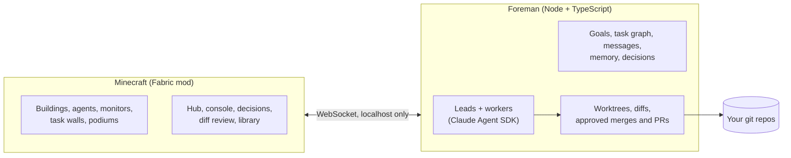
```mermaid
flowchart LR
    subgraph game ["Minecraft (Fabric mod)"]
        HQ["Buildings, agents, monitors,<br/>task walls, podiums"]
        UI["Hub, console, decisions,<br/>diff review, library"]
    end
    subgraph foreman ["Foreman (Node + TypeScript)"]
        Team["Leads + workers<br/>(Claude Agent SDK)"]
        State["Goals, task graph, messages,<br/>memory, decisions"]
        Git["Worktrees, diffs,<br/>approved merges and PRs"]
    end
    Repo[("Your git repos")]
    game <-->|"WebSocket, localhost only"| foreman
    Team --> Git --> Repo
```

- **The Foreman** (`foreman/`) runs the agents and owns all the state: goals, tasks and their
  dependencies, messages, shared memory, decisions, worktrees and watched PRs. Everything is saved to
  disk and Claude sessions resume by id, so it survives restarts and crashes.
- **The mod** (`mod/`) is the window and the controls. It draws what the Foreman knows and sends
  back what you decide. Buildings are saved with the world. If the game closes, no work is lost.
- **The sim backend** is a scripted team that exercises every feature with real git edits. It powers
  the demo, the screenshot QA and development, without any API usage.

<details>
<summary><b>More on the Foreman</b></summary>

<br>

- **Team:** leads (Opus by default) that plan and review, one per building, and up to three workers
  at once (Sonnet by default). Pick the team in the Team tab or with `--workers`.
- **Task graph:** tasks only start when the tasks they depend on are done, and move through todo,
  doing, review and done, with blocked on the side.
- **CI loop:** your tests (or the repo's own CI command) run after each task. A failure goes back to
  the worker once, then to review with the failure noted.
- **Merge conflicts:** when parallel work collides, the branch goes back to its worker, who merges
  your branch in, resolves it and sends a fresh review.
- **Pull requests:** for repos that land as PRs, the Foreman polls each PR, and the lead decides per
  new review thread whether to fold it in, reply, ask you or leave it. Fold-ins become an added
  commit on the same PR, after your approval.
- **Usage:** a usage-limit hold pauses new turns until the window resets and resumes them after; a
  reserve keeps part of your plan for yourself.
- **Messages:** agents message each other and you, and a message to a busy agent reaches it mid task.
- **Protocol:** documented in [docs/protocol.md](docs/protocol.md), generated from the schemas and
  kept in sync by `npm run check`.

</details>

<br>

## Costs

The claude backend bills per token to your Anthropic or cloud provider account (or uses your plan
with `--use-claude-login`). A small goal costs a few dollars. For a cheaper team, use Sonnet for the
lead, low effort and two workers; on Windows:

```powershell
tools\launch.ps1 -Repo C:\path\to\repo -ForemanArgs '--model','sonnet','--effort','low','--workers','juniper,kit'
```

Measured upstream with those settings on the sample repo: three two-task goals, including two merge
conflicts the workers resolved, took 2 to 10 minutes each and about $6 in total. Several leads
working at once cost more: cap them with "Agent turns at once" in the Team tab and "Budget per turn"
in Settings, Usage. With your claude.ai login, the usage reserve (by default 85% of the 5-hour window
and 80% of the 7-day one) stops new agent turns so some of your plan is left for you. The sim
backend is free.

<br>

## Project layout

| Path | What lives there |
|---|---|
| [`foreman/`](foreman) | The orchestrator: agents, goals, task graph, memory, decisions, git safety, PR watching, building designs |
| [`mod/`](mod) | The Fabric mod: buildings and placement, agents, displays, the hub and other screens, HUD |
| [`tools/blueprints/`](tools/blueprints) | Blueprints as code: the parametric kit, the checker and the offline renderer |
| [`assets-src/`](assets-src) | Scripts that generate every skin, block texture and UI sprite |
| [`tools/`](tools) | Launchers, Prism setup, DevBridge CLI, screenshot and QA runner |
| [`docs/`](docs) | Protocol reference, hub and building contracts, QA guide, fork notes |

<br>

## Development

```sh
cd foreman && npm test                     # 761 tests
cd mod && ./gradlew build                  # the mod (gradlew.bat on Windows)
npm test --prefix tools                    # launcher, blueprint and QA tool tests
node tools/qa.mjs --home .agentcraft-home  # capture the 10 shot QA gallery
```

Every in-game visual in this README was captured through the **DevBridge**, a small localhost API in
the mod that scripts use to move the camera and take screenshots; the blueprint previews come from
the offline renderer. Start with [mod/DEV.md](mod/DEV.md) and [mod/FEATURES.md](mod/FEATURES.md) for
the mod, [foreman/README.md](foreman/README.md) for the orchestrator, [docs/HUB.md](docs/HUB.md),
[docs/BUILDINGS.md](docs/BUILDINGS.md) and [docs/PRWATCH.md](docs/PRWATCH.md) for the fork's
features, and [docs/QA.md](docs/QA.md) for the screenshot suite.

<br>

## Status

AgentCraft is young, and this fork younger. Today it is:

- **macOS and Windows.** Both have desktop notifications when the agents need a decision. The
  fork's features have been run on macOS (Apple Silicon) only, and its Prism setup is macOS only;
  upstream covers Windows.
- **Singleplayer,** on **Minecraft 26.3**. Buildings can be placed in any singleplayer world.
- **Fork features tested against the sim backend.** The buildings, hub, leads and PR watching pass
  their tests and the sim runs; a long run with real agents is the next step (see
  [docs/FORK.md](docs/FORK.md)).

Issues and ideas are welcome. Generic fixes from this fork are offered upstream.

<br>

## License

[MIT](LICENSE). All art (skins, block textures and UI sprites) is generated by the scripts in
`assets-src/` and is covered by the same license. Minecraft is not included: Gradle downloads it from
Mojang for development, and players need their own copy of Minecraft: Java Edition. AgentCraft is
not affiliated with Mojang, Microsoft or Anthropic.

<div align="center">
<br>
<sub>Built with Claude.</sub>
</div>
